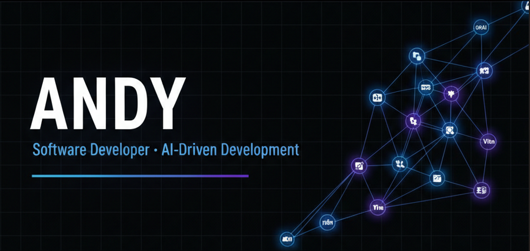

<!-- Banner -->

  

<!-- Título -->
<h1 align="center">👋 Hola, soy Andy | Python Backend Developer</h1>

  🚀 Especializado en crear APIs rápidas, seguras y escalables con Python y Flask 
  📍 Orientado a despliegue y optimización de modelos de IA

---

## 🛠️ Stack Tecnológico

<table>
  <tr>
    <td align="center" style="vertical-align: top; padding: 16px;">
      💻 Lenguajes 
       
      Python  
       
      SQL
    </td>
    <td align="center" style="vertical-align: top; padding: 16px;">
      ⚙️ Frameworks Backend 
       
      Flask  
       
      FastAPI
    </td>
    <td align="center" style="vertical-align: top; padding: 16px;">
      🗄️ Bases de Datos 
       
      MySQL  
       
      SQLite
    </td>
    <td align="center" style="vertical-align: top; padding: 16px;">
      🔄 Control de Versiones 
       
      Git  
       
      GitHub  
       
      Bash
    </td>
  </tr>
  <tr>
    <td align="center" style="vertical-align: top; padding: 16px;">
      🌐 APIs 
       
      RESTful API  
       
      Integración con IA
    </td>
    <td align="center" style="vertical-align: top; padding: 16px;">
      🧰 Herramientas 
       
      Postman  
       
      Docker (básico)
    </td>
  </tr>
</table>

---

## 📂 Proyectos Destacados

| Proyecto            | Descripción                                                   | Tecnologías                        |
|---------------------|---------------------------------------------------------------|------------------------------------|
| **Flask CRUD MySQL**| API CRUD completa con autenticación y manejo de MySQL         | Flask, Python, MySQL, SQLAlchemy   |
| **Flask API para IA** | API que conecta modelos de IA para inferencia en tiempo real | Flask, Python, FastAPI, REST API   |
| **Gestor de Datos** | Backend para carga y gestión de datos desde CSV a MySQL       | Python, Pandas, Flask, MySQL       |

---

## 💡 Skills en acción

- Desarrollo de APIs RESTful robustas y documentadas.
- Manejo de bases de datos relacionales con MySQL y SQLAlchemy.
- Uso avanzado de Git y Git Bash para control de versiones.
- Integración de APIs con modelos de Machine Learning.
- Optimización de consultas SQL y rendimiento de aplicaciones.
- Testeo de endpoints con Postman.

---

## 📫 Contacto

  
  

